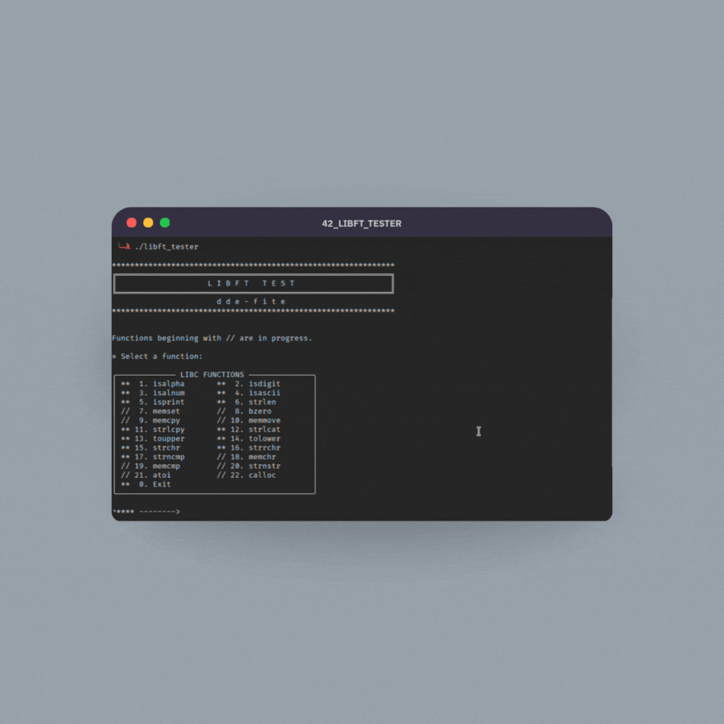

<p align="center">
	
	<h1 align="center">42 Libft Tester</h1>
</p>

<p align="center">
	
	</a>
</p>

<h3 align="center">Warning: This project is under development and there may be bugs and errors when testing the functions. Use this tester ONLY to complement other tests of your own or by third parties.</h3>

<p align="center">
This work is published under the terms of <a href="https://github.com/gcamerli/42unlicense"><b>42 Unlicense</b></a>
</p>

<div align="center">
	<h2>Test your functions with infinite random combinations</h2>
	<p align="center">Just put the tester in your Libft folder and run make. It will copy your code and compile it in isolation. You can enter as many tests as you want, as they are performed randomly. Currently, it only works with some functions.</p>
</div>

<p align="center">
	
</p>

# Functions currently supported
<div align="center">
	<h3>isalpha</h3>
	<h3>isdigit</h3>
	<h3>isalnum</h3>
	<h3>isascii</h3>
	<h3>isprint</h3>
	<h3>strlen</h3>
	<h3>strlcpy</h3>
	<h3>strlcat</h3>
	<h3>toupper</h3>
	<h3>strchr</h3>
	<h3>strrchr</h3>
	<h3>strncmp</h3>
</div>

# Requirements
The source code and Makefile are designed for use in a UNIX-like environment; any use outside this scope does not guarantee correct or efficient operation.
- Make
- GCC

# Usage
- Go to YOUR Libft and download the repository.
``` bash
git clone https://github.com/dde-fite/42_libft_tester.git
```

- Make will compile your code in an isolated environment and compile the tester.
``` bash
make
```

- Now run the binary
``` bash
./libft_tester
```